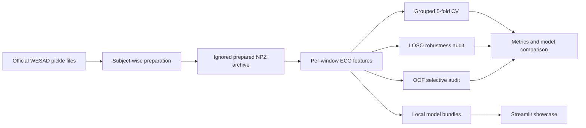

# Reproducibility Guide

## Pipeline architecture



The central invariant is participant separation: subject IDs are assigned before any overlapping
windows are evaluated, and no participant is allowed in both sides of an evaluation split. Prepared
archives, fitted bundles, and JSON artifacts are local outputs covered by `.gitignore`.

## One-command experiment suite

After installing the project and obtaining WESAD through its official access process, run the complete
feature-model suite from an already prepared archive:

```powershell
python scripts/run_experiment_suite.py `
  --data data\processed\wesad_core_140hz_30s_robust.npz `
  --output artifacts\wesad-suite `
  --models shrinkage-lda balanced-shrinkage-lda `
  --sample-rate 140 `
  --folds 5 `
  --bootstrap-samples 2000 `
  --min-coverage 0.3 `
  --inner-folds 3 `
  --seed 42
```

To prepare the standard raw WESAD layout and run the same suite in one command:

```powershell
python scripts/run_experiment_suite.py `
  --input-root data\raw\WESAD `
  --data data\processed\wesad_core_140hz_30s_robust.npz `
  --output artifacts\wesad-suite `
  --sample-rate 140 `
  --folds 5 `
  --bootstrap-samples 2000 `
  --seed 42
```

The suite runs, for every requested model:

1. subject-grouped cross-validation;
2. four-feature-set LOSO robustness analysis;
3. training-only OOF selective prediction audit;
4. local bundle training with an OOF-derived confidence threshold.

The output contains a top-level `suite_summary.json` plus one directory per model. The summary points
to every detailed artifact without copying any raw signal. Use a smaller `--bootstrap-samples` value
and one model for a quick smoke run; formal reported results use the defaults above.

## Reproducibility record

Every formal result should record:

- dataset archive path and preparation settings;
- model name and feature set;
- sampling rate, window size, stride, and label purity;
- split strategy and subject lists;
- random seed and bootstrap count;
- confidence-threshold objective and minimum coverage;
- code commit used to produce the artifact.

The benchmark, robustness, and selective reports in `reports/` are intentionally explicit about these
choices so results can be audited rather than treated as a single leaderboard number.
