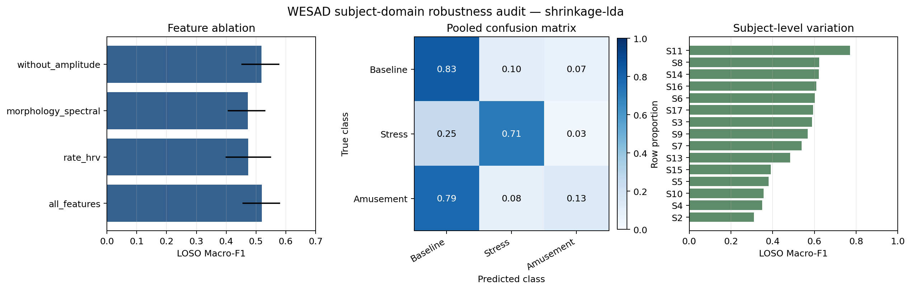
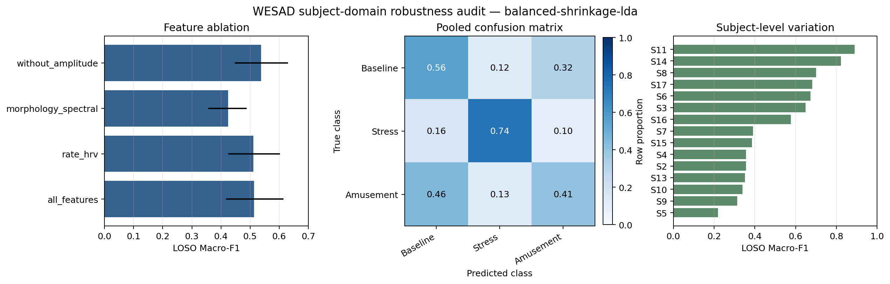

# Subject-Domain Robustness Audit

## Protocol

This audit uses Leave-One-Subject-Out (LOSO) evaluation on the primary WESAD task. Each participant
is held out once, the model is trained on all other participants, and metrics are first computed per
participant before averaging. This prevents participants with more windows from dominating the result.

The audit runs four predefined feature sets and two decision-prior modes. Feature-set selection and
prior-mode comparison are descriptive; neither is tuned on the held-out subject predictions.

## Visual summary

The figures are generated from the local JSON artifacts and are safe to publish because they contain
metrics only, not ECG samples or participant records.





| Setting | Value |
|---|---:|
| Models | Shrinkage LDA and equal-prior shrinkage LDA |
| Subjects | 15 |
| Features | 22 total; 140 Hz, 30-second windows |
| Split | Leave-One-Subject-Out |
| Bootstrap samples | 2,000 subject-level resamples |
| Confidence interval | Percentile 95% CI for the mean |

## Feature ablation

The feature ablation uses the empirical-prior Shrinkage LDA to keep the comparison aligned with the
primary benchmark.

| Feature set | Features | Macro-F1 | Subject SD | Bootstrap 95% CI |
|---|---:|---:|---:|---:|
| All features | 22 | **0.5194** | 0.1286 | 0.4550-0.5810 |
| Without amplitude | 20 | 0.5185 | 0.1272 | 0.4515-0.5782 |
| Rate and HRV | 13 | 0.4744 | 0.1508 | 0.3985-0.5505 |
| Morphology and spectral | 9 | 0.4726 | 0.1258 | 0.4049-0.5323 |

The complete feature set is retained because it has the highest mean Macro-F1. Removing R-peak
amplitude features barely changes Macro-F1, suggesting that amplitude is not essential for this
cross-subject result. HRV-only and morphology/spectral-only representations lose complementary signal.

## Decision-prior operating modes

The empirical-prior model uses the class frequencies observed in each training partition. The
class-balanced model assigns equal priors at fit time. Equal priors are a transparent decision rule
for a macro-averaged objective; they are not a threshold tuned on the test set.

| Mode | Prior policy | Accuracy | Balanced accuracy | Macro-F1 | Amusement recall | Subject Macro-F1 SD |
|---|---|---:|---:|---:|---:|---:|
| Conservative benchmark | Empirical training priors | **0.6791** | 0.5547 | **0.5194** | 0.1326 | **0.1286** |
| Class-balanced demo | Equal class priors | 0.5875 | **0.5658** | 0.5138 | **0.4065** | 0.2020 |

The main finding is a genuine operating-point trade-off. Empirical priors produce higher overall
accuracy and more stable participant-level Macro-F1, but the model rarely predicts Amusement. Equal
priors increase Amusement recall by roughly three times and slightly improve balanced accuracy, at the
cost of lower accuracy and greater subject-to-subject variation. Therefore, the repository exposes
both modes:

- `shrinkage-lda` is the conservative benchmark and the appropriate apples-to-apples comparison.
- `balanced-shrinkage-lda` is the recommended showcase mode when demonstrating coverage of all three
  classes matters more than raw accuracy.

The balanced mode is not presented as a universal model upgrade. Its LOSO Macro-F1 is `0.5138` with a
bootstrap 95% CI of `0.4172-0.6150`, which overlaps the empirical-prior result and remains wide.

## Class-level behavior

LOSO means are computed per subject and then averaged. The pooled confusion matrices below are shown
as counts across all held-out windows; rows are true classes and columns are predicted classes, ordered
as Baseline, Stress, Amusement.

| Mode | Class | Precision | Recall | F1 |
|---|---|---:|---:|---:|
| Empirical priors | Baseline | 0.6917 | **0.8285** | **0.7357** |
| Empirical priors | Stress | **0.8442** | 0.7029 | 0.6807 |
| Empirical priors | Amusement | 0.3555 | 0.1326 | 0.1419 |
| Equal priors | Baseline | 0.6387 | 0.5605 | 0.5530 |
| Equal priors | Stress | 0.8105 | **0.7303** | 0.6912 |
| Equal priors | Amusement | 0.2669 | **0.4065** | **0.2970** |

Empirical-prior pooled confusion matrix:

```text
                 Predicted
True          Baseline  Stress  Amusement
Baseline           950     118         81
Stress             163     457         22
Amusement          274      28         47
```

Equal-prior pooled confusion matrix:

```text
                 Predicted
True          Baseline  Stress  Amusement
Baseline           641     143        365
Stress             104     474         64
Amusement          159      47        143
```

The class-balanced matrix makes the limitation visible: it recovers more Amusement windows, but also
over-predicts Amusement for Baseline windows. This is preferable to hiding the minority-class failure
behind an accuracy number, but it still requires confidence-aware review.

## Subject-level results

The empirical-prior all-feature model has the following participant-level Macro-F1 values:

| Subject | Macro-F1 | Subject | Macro-F1 | Subject | Macro-F1 |
|---|---:|---|---:|---|---:|
| S2 | 0.311 | S7 | 0.539 | S13 | 0.484 |
| S3 | 0.588 | S8 | 0.624 | S14 | 0.621 |
| S4 | 0.350 | S9 | 0.568 | S15 | 0.391 |
| S5 | 0.381 | S10 | 0.357 | S16 | 0.609 |
| S6 | 0.603 | S11 | **0.771** | S17 | 0.594 |

The observed range is wide (`0.311-0.771`), which is evidence of participant domain shift. The mean
training Macro-F1 is `0.6171`, compared with the empirical LOSO test Macro-F1 of `0.5194`. This gap is
meaningful but substantially smaller than the nonlinear overfit baselines previously rejected.

## Confidence and interpretation

The empirical all-feature LOSO model reaches mean accuracy `0.6791` and balanced accuracy `0.5547`.
Its mean expected calibration error is `0.1547`. The equal-prior model has lower mean confidence and
higher calibration variation across subjects, so the balanced mode should be treated as a review aid,
not an autonomous emotion assessment.

A model trained on this cohort should not be assumed to transfer to a new device, population, or
free-living setting.

## Reproduction

Empirical-prior audit:

```powershell
python -m ecg_emotion.cli audit-subject-robustness `
  --data data\processed\wesad_core_140hz_30s_robust.npz `
  --output artifacts\wesad-subject-robustness `
  --model shrinkage-lda `
  --sample-rate 140 `
  --bootstrap-samples 2000 `
  --seed 42
```

Class-balanced audit:

```powershell
python -m ecg_emotion.cli audit-subject-robustness `
  --data data\processed\wesad_core_140hz_30s_robust.npz `
  --output artifacts\wesad-subject-robustness-balanced `
  --model balanced-shrinkage-lda `
  --sample-rate 140 `
  --bootstrap-samples 2000 `
  --seed 42
```

The repository also contains local-only figures generated from these JSON files under
`reports/figures/`. Raw WESAD files, prepared windows, fitted models, and participant-level artifacts
are not committed.
